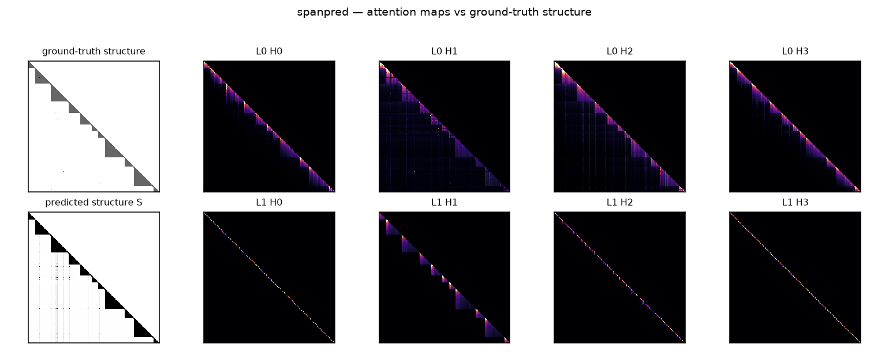
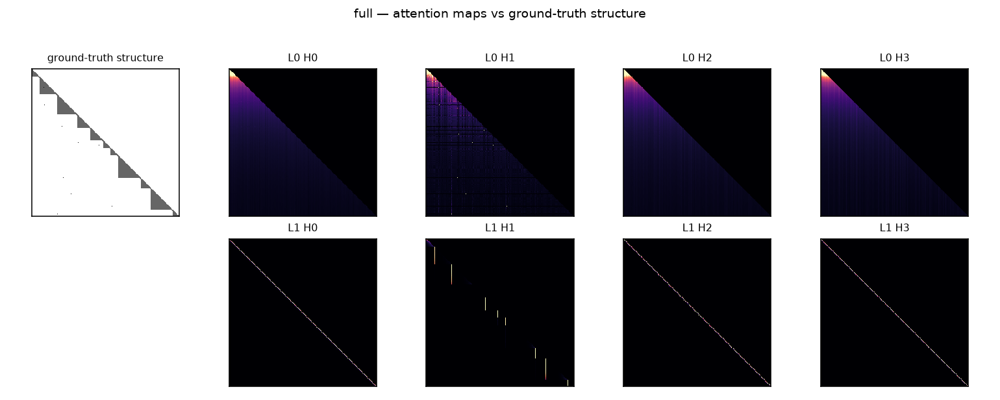
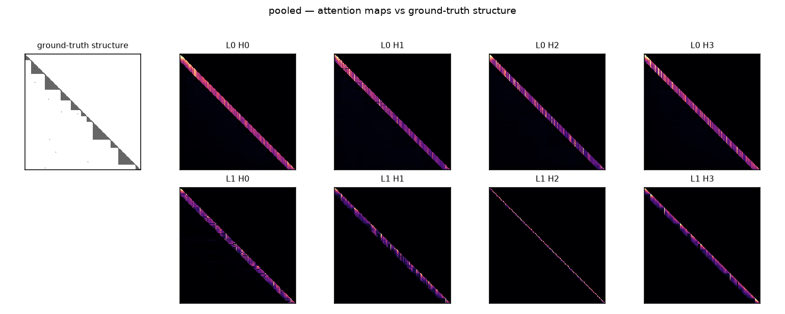

# etension — attention compression at full resolution

Attention costs N² because it builds an explicit map from every position to
every position. Every cheaper alternative replaces that map with a compressed
description of it. This repo is a controlled test of **which compression is the
right one** — specifically, whether the standard compressions throw away
exactly the thing that matters: **long-range connection at full resolution**.

## The claim under test

Hierarchical/pyramid schemes (wavelet-flavoured attention, pooled summaries)
reach distant positions only by climbing to a coarse scale, and climbing means
averaging — so a distant position is reachable only as a gist, never as a
sharp feature that stays sharp. Low-rank schemes keep smooth structure and
destroy edges by nature; they can only ever return a blurry reconstruction.

The structure actually visible in real attention maps is the opposite of
smooth: stripes, and **triangles** — contiguous regions anchored on the
diagonal, opening at a boundary and closing at the next one. A triangle is
full rank, so no low-rank scheme can represent it, yet it is fully described
by two numbers: its start and its end. That is the split this repo is built
around: structure that is **cheap to specify and impossible to approximate
smoothly**. The triangles are the bounding boxes; the objects to be detected
are the spans (the YOLO framing, taken literally).

A note on wavelets: the wavelet *transform* is invertible — fine detail at
distance exists in the pyramid as fine-scale coefficients. What blurs is the
*attention pattern over the pyramid*: touching the fine-scale coefficients of
a distant region costs as much as full attention, so pyramid-attention schemes
only touch the coarse ones. The failure is in which coefficients you can
afford to reach, not in the basis.

## The task

`etension/task.py` generates sequences where the ground-truth attention
structure is known exactly. The output is a sum of three multiplicative
interactions (the presence/magnitude of one feature modulates the contribution
of another — nothing is solvable by attending to either feature alone), plus
irreducible noise:

| component | definition | attention row needed | what it tests |
|---|---|---|---|
| local | `y_i += u_i · v_{i-1}` | previous position | the easy column |
| segment | `y_i += v_i · (Σ_{m=s_i..i} u_m)/√t` | the **triangle** `[s_i, i]` | boundary sharpness |
| pair | `y_k += 2 · u_k · v_j` for key-matched pairs `j → k` | one spike at `j` | full-resolution retrieval at distance |

Design decisions that make the test mean something:

- **`v` is white noise.** The average of any window around a pair source `j`
  carries almost none of `v_j`; a mechanism that reaches `j` only through a
  `(2W+1)`-wide average has a provable R² ceiling of ~`1/(2W+1)` on the pair
  probe. Sharpness is enforced by construction, not assumption.
- **Pair distances are sampled in three bands** (near ≤16, mid 24–64, far
  96–248) so retrieval is reported **per distance and never averaged** — local
  is easy, would dominate any aggregate, and the entire question lives in the
  far column.
- **Pairs are addressed by content, and addressing is made as learnable as
  possible on purpose**: the source advertises a unit-norm key in dedicated
  "address" channels, the target asks with the same key in separate "query"
  channels. Matched keys dot to exactly 1, unmatched to ~0, matching is linear
  in the input, and there is no self-match to gate away — so failures on the
  pair probe are attributable to the mechanism's resolution at distance, not
  to how hard the addressing circuit is to form.
- **Boundaries are visible in the input.** Discovering *what counts as* a
  boundary is not the axis under test; using one at range and resolution is.
- Targets are a deterministic function of the inputs given the metadata and a
  frozen noise draw, so counterfactual edits have **exact** ground-truth
  deltas.

## The mechanisms

One backbone (embedding → blocks → head); only the token mixer differs
(`etension/models.py`):

| mixer | what it is | what it stands in for |
|---|---|---|
| `full` | causal softmax attention | the O(N²) reference |
| `local` | sliding-window attention (w=16) | locality-only compression |
| `pooled` | window + softmax over average-pooled chunks at scales 16 and 64 | the wavelet pyramid: distance only via coarse averages |
| `lowrank` | causal linear attention (kernel feature maps, prefix sums) | low-rank maps: smooth survives, edges die |
| `oracle` | full attention with support restricted to ground-truth structure (triangle ∪ pairs ∪ band) | *is the structural prior sufficient?* |
| `spanpred` | full attention biased by a cheap learned structure predictor | *can a cheap predictor find the structure?* |

`spanpred` is the learned-transform idea made concrete. A small causal conv
predicts per-position boundary scores β; these parameterise a differentiable
soft triangle `T[i,j] = Π_{m∈(j,i]}(1−β_m)` ("no boundary separates j from i")
— O(N) numbers specifying a full-rank mask. A low-dimensional head scores pair
links. Both are **soft everywhere during training and thresholded only at
inference**, which is the YOLO answer to "discrete choices don't pass
gradients". The ground-truth structure supervises the predictor heads as an
auxiliary loss — **a teacher, not a cage**: attention is never architecturally
restricted to the supervised pattern; at inference the predictor is free to
place structure where supervision never showed it.

## The evaluation

`etension/evaluate.py` refuses aggregate error as a headline number. Each
capability is measured by a **counterfactual probe**: edit one input, recompute
the exact ground-truth change, and measure R² of the model's output change
against it.

- **Pair probe, per distance band** — resample `v` at pair sources; does the
  target's output track `u_k·Δv_j`? This is retrieval at full resolution.
- **Segment probe** — resample one `u` near a segment start; do all later
  positions in the segment track the change through the running sum?
- **Local probe** — the easy column, reported to show it does *not*
  discriminate.
- **Boundary leakage probe** — resample every `u` in the segment *before* a
  boundary. Ground truth after the boundary is exactly unchanged (asserted);
  any model-output change after the boundary is structure blur. Reported as
  rms(after)/rms(before).

Two separations are enforced by design:

1. **Prior correctness vs. predictor quality.** `oracle` isolates "would
   perfect knowledge of the boundaries be enough"; `spanpred` minus `oracle`
   is the predictor gap; `full` minus `oracle` is the prior's error. A good
   idea with a bad predictor can no longer look identical to a bad idea.
2. **Local vs. long-range.** Every table keeps the distance bands as separate
   columns. There is no aggregate that mixes them.

Two more measurements close the loop on "is the boundary structure a
sufficient description of what attention does":

- **Attention mass inside structure** — fraction of the trained full model's
  attention that falls inside the ground-truth mask, and mass on the far
  source at pair rows (best head).
- **Inference-time ablation** — take the *trained* full model, mask its
  attention to the ground-truth structure with no retraining, and re-run all
  probes. If nothing degrades, no important mass lives outside the boundary
  description.

## Task validity (before any training)

`etension/validate_task.py` runs closed-form readouts through the same probes
(`results/task_validation.json`):

| readout | pair near | pair mid | pair far | segment | leakage |
|---|---|---|---|---|---|
| exact oracle | 1.000 | 1.000 | 1.000 | 1.000 | 0.000 |
| pair source blurred, W=8 | 0.126 | 0.127 | 0.127 | 1.000 | 0.000 |
| pair source blurred, W=32 | 0.040 | 0.038 | 0.037 | 1.000 | 0.000 |
| boundaries snapped to grid 16 | 1.000 | 1.000 | 1.000 | 0.956 | 0.459 |
| boundaries snapped to grid 64 | 1.000 | 1.000 | 1.000 | 0.825 | 0.497 |

Perfect structural knowledge is sufficient (exact oracle hits the noise floor,
NMSE 0.041 ≈ σ²/var(y)). Blur fails **exactly** the intended columns: window-
averaging the source kills only the pair columns, to the predicted ~1/(2W+1)
ceiling; snapping boundaries to a pooling grid produces only leakage and
segment degradation. A mechanism's probe profile is therefore attributable to
the mechanism.

## Results

All six mechanisms, identical backbone (~117k params), identical data stream,
4000 steps. R² of predicted output change against exact ground-truth change
under counterfactual edits; noise-floor NMSE 0.039. Full numbers in
`results/summary.md` / `results/summary.json`.

| mixer | pair near | pair mid | pair **far** | segment | local | leakage ↓ | nmse ↓ |
|---|---|---|---|---|---|---|---|
| full | 0.993 | 0.991 | **0.991** | 0.945 | 0.990 | 0.024 | 0.083 |
| local | 0.800 | 0.019 | **0.000** | 0.778 | 0.833 | 0.274 | 0.292 |
| pooled | 0.798 | 0.036 | **0.003** | 0.821 | 0.852 | 0.210 | 0.256 |
| lowrank | 0.771 | 0.617 | **0.414** | 0.961 | 0.521 | 0.048 | 0.364 |
| oracle | 0.994 | 0.989 | **0.993** | 0.985 | 0.896 | 0.055 | 0.078 |
| spanpred | 0.992 | 0.993 | **0.992** | 0.971 | 0.958 | 0.123 | 0.094 |

**The two standard compressions fail on orthogonal axes, both as predicted.**
`pooled` — the pyramid — has global reach and it is worth nothing at
resolution: far retrieval 0.003, no head puts more than 1% of its mass on the
far source, because the source only exists as a chunk average. Its smooth read
is fine (segment 0.821): gist survives the climb, sharpness does not.
`lowrank` is the mirror image: the best cheap mechanism at the smooth read
(segment 0.961, leakage 0.048) while sharp selection is weak *everywhere
including nearby* — local is 0.521 with the source one position away, and
retrieval decays gradually with distance (0.77 → 0.62 → 0.41) as prefix
competition washes out the soft match. Pyramids fail by distance; low rank
fails by sharpness. Neither can hold a sharp feature at range.

**The structural prior is sufficient.** `oracle` (trained with support
restricted to triangle ∪ pairs ∪ band) matches full attention on every pair
column and beats it on the segment read (0.985 vs 0.945) — the mask does the
boundary-exclusion the unconstrained model has to learn. Perfect knowledge of
the boundaries is enough.

**A cheap predictor finds it.** `spanpred` closes the oracle gap almost
entirely (far 0.992 vs oracle 0.993) with a two-conv boundary head and a
rank-8 link head over raw inputs. The best layer-0 head puts 98% of its mass
exactly on the far source. Its one visible weakness is boundary sharpness
(leakage 0.123 vs full's 0.024): the soft triangle is only as sharp as β.

**Thresholded at inference (the YOLO move), retrieval survives on a budget of
~15 slots per row** (vs. the ~128 an average causal row has): far pair R²
0.969 with the soft bias replaced by a hard `S > 0.5` mask. What degrades is
the smooth read (segment 0.654) — thresholding clips the tails of long
triangles. The oracle row shows this is predictor calibration, not a failure
of the prior: with true boundaries the hard triangle costs nothing.

**Is the boundary structure a sufficient description of what attention does?
Two different answers, and the difference is the finding.** As a
*specification* — train with it — yes: `oracle` and `spanpred` lose nothing.
As a *description of what unconstrained training finds* — no: masking the
trained full model to the ground-truth structure at inference destroys it
(segment R² −8.6, NMSE 5.07), and its layer-0 carries only 24% of its mass
inside the structure even while its best head is 97% on the far needle. The
sharp needle-finding lives inside the structural description; the model's
smooth machinery (broad, distributed averaging) does not. Compression by
boundaries has to be imposed during training, not read off afterwards.

**Trainability was the hidden variable.** Under plain MSE, full attention
failed to form the retrieval circuit at all (far R² ≈ 0 after 3000 steps):
routing the source payload has zero first-order gradient until the
multiplicative readout exists, and vice versa. It needed the pair rows
upweighted to escape the saddle. The structural mixers face the same saddle
with a much smaller search space — which is the supervision argument from the
other direction: the prior is not just a cost model, it is an optimization
aid.

### Look at it

The maps are legible, which was part of the point. `spanpred`'s layer-0 heads
organise into the segment triangles by themselves, and the predicted structure
panel is nearly indistinguishable from the ground truth; `pooled`'s mass is
visibly trapped in its diagonal band.





Remaining figures: `results/figs/{local,lowrank,oracle}.png`.

## Running it

```
pip install -r requirements.txt
python -m etension.validate_task            # task validity, no training
python -m experiments.run_all --steps 4000  # everything: ~30-40 min on 4 CPU cores
# or individually:
python -m etension.train --mixer full --steps 4000
python -m etension.evaluate --ckpt results/full
python -m etension.visualize --ckpt results/full
```

## Scope, honestly stated

This benchmark measures **representational adequacy**, not wall-clock cost.
`spanpred` materialises its soft mask densely (O(N²) memory) because the
question here is whether boundary-parameterised structure *can carry the
information*; the O(N·K) sparse kernel that spends a budget of K coefficients
per row is the production goal, and `mean_slots_per_row` in the
threshold-at-inference results measures what K would need to be. Training
compute is also deliberately modest; the mechanisms are compared under an
identical budget, and conclusions are about their ordering, not their ceilings.
